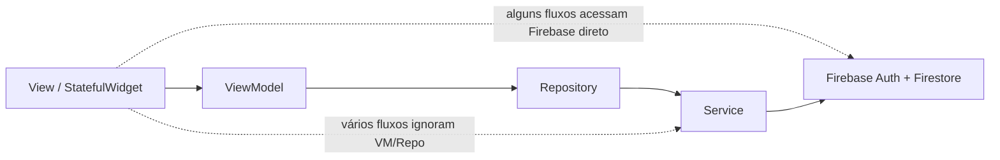
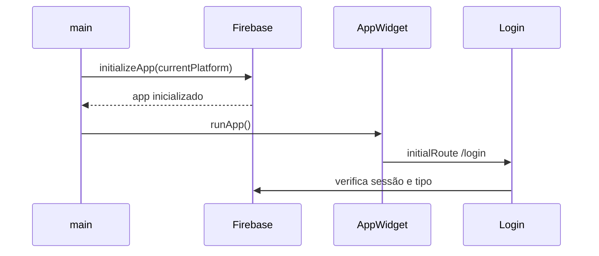
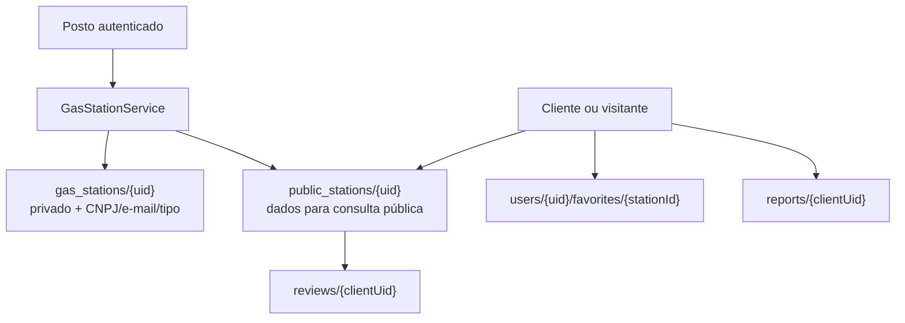

# Arquitetura — Completai

Retrato do código em **17/08/2026**. Descreve o que existe; recomendações indicam direção, não funcionalidade implementada.

## Visão geral

Completai é app Flutter que conecta motoristas e postos de combustível em **Bebedouro**. Não há backend próprio: o cliente fala diretamente com **Firebase Authentication** e **Cloud Firestore**.

Dois papéis operacionais:

- **cliente** — consulta postos, compara preços, ordena resultados, favorita, avalia e denuncia;
- **posto** — cadastra perfil, mantém preços, serviços, tags e horários.

Entrega principal: **Android**. Firebase configurado para Android e Web em `lib/firebase_options.dart`; demais plataformas lançam `UnsupportedError`.

## Camadas

Arquitetura **feature-first com MVVM parcial e acesso direto ao Firebase**.



| Camada | Responsabilidade | Onde aparece |
|---|---|---|
| `app/` | `MaterialApp`, tema, rotas nomeadas | `app_widget.dart`, `app_routes.dart` |
| `core/` | tokens visuais e widgets reutilizáveis | `theme/`, `widgets/` |
| `features/*/views/` | UI, estado local, coordenação de fluxo | `*_page.dart` |
| `features/*/viewmodels/` | validação e orquestração fina | cadastros auth e posto |
| `features/*/repositories/` | fachada sobre service | pass-through, sem cache |
| `features/*/services/` | operações Firestore/Auth | leitura/escrita por domínio |
| `features/*/models/` | DTOs e parsing Firestore | `*_model.dart`, `public_gas_station.dart` |

**Por que MVVM é parcial:** cadastros (login, registro cliente, registro posto) seguem View → ViewModel → Repository → Service. Dashboard, perfis, configurações e consulta pública chamam services ou Firebase diretamente nas views. MVVM é convenção localizada, não contrato global.

**Por que não há DI central:** services instanciam singletons Firebase diretamente (`FirebaseFirestore.instance`), exceto `PublicStationService`, que aceita injeção opcional para testes.

## Bootstrap



1. `main.dart` chama `WidgetsFlutterBinding.ensureInitialized()` e `Firebase.initializeApp`.
2. `AppWidget` aplica `AppTheme.lightTheme`, rota inicial `/login` e mapa de rotas nomeadas.
3. Não há tela de erro/fallback se Firebase falhar antes de `runApp`; falha de inicialização impede renderização.

## Autenticação e decisão de papel

Após login, `login_page.dart` lê em paralelo:

- `users/{uid}`;
- `gas_stations/{uid}`.

Regra de roteamento:

- se documento de posto existe e `type == gas_station` → dashboard do posto;
- senão, se documento cliente existe com `type == client` → lista de postos.

**Precedência do posto** é relevante: usuário com ambos os documentos abre dashboard. Detalhes de risco em [docs/REGRAS-DE-NEGOCIO-E-SEGURANCA.md](docs/REGRAS-DE-NEGOCIO-E-SEGURANCA.md).

`google_sign_in` está declarado em `pubspec.yaml`, mas **não há integração em `lib/`**.

## Modelo de dados e denormalização

Dados de posto existem em duas projeções:



**Por que denormalizar:** expor CNPJ e e-mail do posto na consulta pública violaria privacidade; projeção pública omite campos sensíveis.

**Como mantém consistência:** `GasStationService` usa batch writes para gravar privado e público juntos nas operações normais. `_ensurePublicProfile` recria perfil público quando perfil privado é carregado.

**Riscos remanescentes:**

1. rules permitem que cliente autorizado escreva estruturas válidas diretamente, sem passar pelo service;
2. restauração parcial após falha de exclusão pode divergir subcoleções.

Schema completo: [docs/MODELO-DE-DADOS.md](docs/MODELO-DE-DADOS.md).

## Leitura pública e ranking

`PublicStationService.getStations()`:

1. busca coleção `public_stations` no servidor, com fallback para cache;
2. filtra `city == Bebedouro` no cliente;
3. para cada posto, consulta subcoleção completa `reviews`;
4. calcula média simples;
5. UI ordena por score bayesiano, gasolina, etanol ou diesel S10.

Score de ranking:

```text
((quantidade × média) + (10 × 4)) / (quantidade + 10)
```

**Trade-offs observados:**

- score bayesiano reduz viés de poucas notas máximas;
- fallback de avaliações não derruba lista inteira;
- filtro de cidade após leitura total evita índice composto, mas transfere filtro ao client;
- padrão N+1 de reviews escala mal; sem paginação; média recalculada no client.

**Pendência:** geolocalização e distância não estão implementadas apesar do objetivo de proximidade; escopo atual é comparação local em Bebedouro.

## Estado e navegação

- estado local: `StatefulWidget`, `TextEditingController`, flags booleanas;
- streams: dados administrativos e reviews em telas grandes;
- sem Provider, Riverpod, Bloc ou service locator;
- rotas nomeadas em `AppRoutes` + `MaterialPageRoute` em fluxos pontuais (ex.: perfil público com `stationId`).

## Camada de apresentação

`AppTheme.lightTheme` é autoridade de cores e tipografia. `core/widgets/` define contratos reutilizáveis: preço, status, confiança, progresso, cabeçalho de descoberta. Views compõem esses componentes; não devem declarar paleta local. Detalhes em [DESIGN.md](DESIGN.md).

## Pontos fortes

- separação por domínio facilita descoberta de código;
- documentos privados e públicos evitam expor CNPJ/e-mail;
- batches reduzem divergência em gravações do posto;
- modelos públicos normalizam dados Firestore e suportam horários cruzando meia-noite;
- mensagens de erro Firebase são traduzidas em vários fluxos;
- testes unitários cobrem validações, ranking e contratos visuais básicos.

## Dívida arquitetural priorizada

| Prioridade | Problema | Efeito | Direção |
|---|---|---|---|
| P0 | papel derivado de documentos graváveis pelo cliente | escalada cliente → posto | custom claims/Admin SDK ou fluxo servidor confiável |
| P1 | acesso Firebase direto em views | testes difíceis e regra espalhada | gateways/use cases injetáveis |
| P1 | N+1 de reviews | custo/latência cresce por posto | agregados `averageRating/reviewCount` + paginação |
| P1 | telas monolíticas | regressão e divergência visual | extrair controllers/sections/dialogs por caso de uso |
| P1 | exclusão não recursiva | subcoleções órfãs | Cloud Function ou rotina backend idempotente |
| P2 | MVVM parcial/repositories vazios | abstração inconsistente | definir padrão ou remover camada sem função |
| P2 | navegação mista | parâmetros e guards frágeis | roteador tipado e guard de sessão/papel |
| P2 | Firebase bloqueia bootstrap | tela branca/falha total | estado de inicialização e recuperação |

## Documentos relacionados

- [STRUCTURE.md](STRUCTURE.md) — organização de pastas e convenções
- [DESIGN.md](DESIGN.md) — design system e regras de interface
- [PRODUCT.md](PRODUCT.md) — propósito, escopo e princípios de produto
- [docs/MODELO-DE-DADOS.md](docs/MODELO-DE-DADOS.md) — schema Firestore
- [docs/REGRAS-DE-NEGOCIO-E-SEGURANCA.md](docs/REGRAS-DE-NEGOCIO-E-SEGURANCA.md) — regras funcionais e achados de segurança
- [docs/DESIGN-E-INTERFACE.md](docs/DESIGN-E-INTERFACE.md) — auditoria UX (separada do design system)
