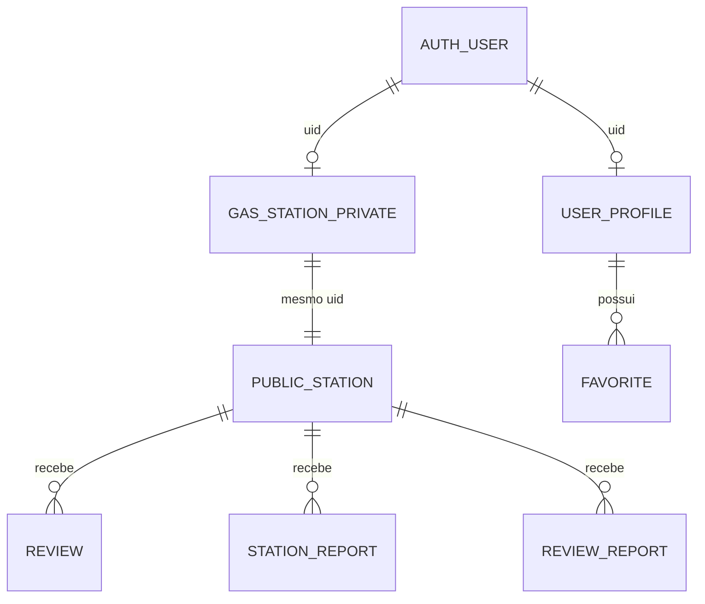

# Modelo de dados

## Apresentação pública do posto — 31/08/2026

Os documentos `gas_stations/{uid}` (privado) e `public_stations/{uid}` (público) podem conter `stationBrand`. A ausência ou um valor inválido resulta em “Bandeira branca”. Documentos antigos com `coverImagePath` continuam legíveis, mas esse campo legado é removido no próximo salvamento.

| Campo | Tipo | Projeções | Regra |
|---|---|---|---|
| `stationBrand` | `string` opcional | privada e pública | texto de 2 a 60 caracteres; opções de UI Shell, Ipiranga, Petrobras, ALE, RodOil, Bandeira branca ou “Outra” |
| `updatedAt` | timestamp | privada e pública | atualizado junto com a apresentação |

Cada capa fica em um documento separado `station_covers/{uid}` com `stationId`, `bytes` (`Blob` JPEG), `contentType`, `byteSize` e `updatedAt`. O app aceita JPG, PNG ou WebP de até 5 MiB, redimensiona para no máximo 1280 px e comprime para até 500 KiB antes da gravação. A listagem não consulta capas; apenas o detalhe público e a área administrativa leem esse documento.

As duas projeções e o documento da capa são atualizados na mesma transação Firestore. Salvar somente a bandeira preserva a capa existente; substituir ou remover a foto altera `station_covers/{uid}` atomicamente.

A solução não usa Firebase Storage nem exige ativar o plano Blaze. As regras Firestore foram validadas com `firebase deploy --only firestore:rules --dry-run`; não houve deploy.

## Visão conceitual



Firestore é schemaless; formatos abaixo são contratos implementados por services e `firestore.rules`.

## `users/{uid}`

Perfil privado do cliente.

| Campo | Tipo | Regra |
|---|---|---|
| `uid` | string | igual ao UID autenticado |
| `name` | string | 3–120 caracteres |
| `email` | string | 5–254; igual ao token Auth |
| `phone` | string | 10–11 dígitos |
| `type` | string | literal `client` |
| `createdAt` | timestamp | `request.time` na criação |

Atualização permite somente `name` e `phone`.

### `users/{uid}/favorites/{stationId}`

| Campo | Tipo | Regra |
|---|---|---|
| `stationId` | string | igual ao ID do documento e posto público existente |
| `createdAt` | timestamp | `request.time` |

Documento por posto torna operação idempotente. Update proibido.

## `gas_stations/{uid}`

Perfil privado do posto.

| Campo | Tipo | Observação |
|---|---|---|
| `uid` | string | UID Auth e ID do documento |
| `name` | string | 3–120 |
| `cnpj` | string | exatamente 14 dígitos; validade algorítmica não verificada |
| `phone` | string | 10–11 dígitos |
| `email` | string | igual ao token Auth |
| `address` | string | 3–200 |
| `neighborhood` | string | 2–100 |
| `city` | string | case-insensitive `Bebedouro` |
| `type` | string | literal `gas_station` |
| `fuelPrices` | map | até cinco chaves conhecidas |
| `tags` | list | máximo 10 itens |
| `services` | list | máximo 15 itens |
| `openingHours` | map | chaves dos sete dias |
| `createdAt`/`updatedAt` | timestamp | servidor |

## `public_stations/{stationId}`

Projeção pública do posto. Exclui `cnpj`, `email` e `type`; mantém contato, localização e dados operacionais. `stationId == uid`.

Combustíveis aceitos:

- `gasolineRegular`;
- `gasolineAdditive`;
- `ethanol`;
- `dieselS10`;
- `dieselS500`.

Preço, quando presente: número maior que 0 e no máximo 50.

`openingHours` usa chaves inglesas `monday`…`sunday`, cada uma produzida pelo app como:

```json
{ "enabled": true, "open": "06:00", "close": "22:00" }
```

Rules validam somente mapa e nomes dos dias; não validam campos internos, tipos nem formato HH:mm.

## `public_stations/{stationId}/reviews/{reviewId}`

Uma avaliação por cliente, pois `reviewId == request.auth.uid`.

| Campo | Tipo | Regra |
|---|---|---|
| `userId` | string | UID cliente |
| `authorName` | string | igual ao nome atual em `users/{uid}` |
| `rating` | number | 1–5 |
| `comment` | string | 3–500 |
| `createdAt`/`updatedAt` | timestamp | servidor na criação; `updatedAt` na edição |

Mudança do nome do cliente não atualiza automaticamente avaliações antigas. Na edição da avaliação, rules exigem nome atual, então service deve reenviá-lo.

## Denúncias

### `review_reports/{reviewId_reporterUid}`

Contém `reviewId`, `stationId`, `reporterUid`, motivo enumerado, `status: pending` e `createdAt`. Leitura: dono do posto ou denunciante. Update/delete: proibidos ao cliente.

### `reports/{reporterUid}`

Denúncia do posto por cliente. Uma por cliente/posto, sobrescrita apenas se ainda não existe — update é proibido. Contém motivo enumerado, detalhes até 500, status pendente e timestamp.

## Modelos Dart versus persistência

- `UserModel` e `GasStationModel` são DTOs de cadastro e incluem senha em memória; senha nunca vai ao Firestore.
- `PublicGasStation` é modelo de leitura e agrega média/quantidade calculadas fora do documento.
- `StationReview` faz parsing defensivo e converte timestamps.
- Não há modelos tipados para favoritos e denúncias.

## Lacunas de integridade

- CNPJ não é validado por dígitos verificadores nem garantido único.
- e-mail tem checagem superficial na UI; Firebase fornece validação final.
- tags/services têm limite de quantidade, mas rules não garantem strings, valores permitidos ou unicidade.
- horários internos não são validados nas rules.
- `averageRating` e `reviewCount` não persistem; custo de agregação cresce linearmente.
- timestamps restaurados durante rollback de exclusão perdem valores históricos originais.
